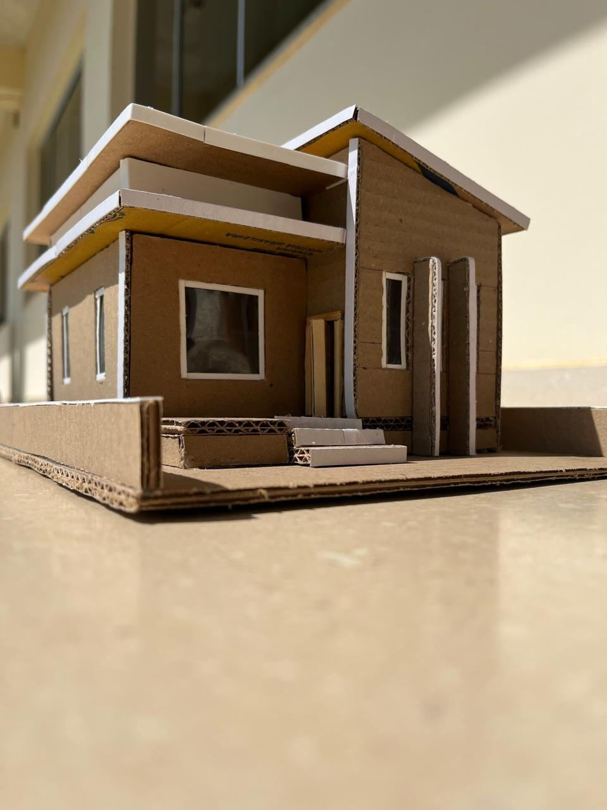
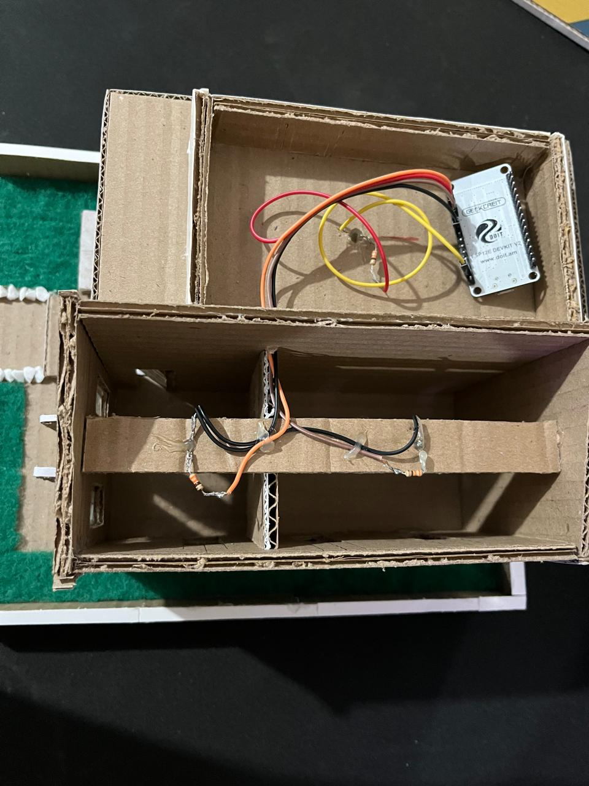

# Mini-Casa-Automatizada

## 🏠 Introdução

Este projeto demonstra como construir uma mini casa automatizada com iluminação controlada via ESP8266 e assistente virtual. A ideia é integrar conceitos de IoT para criar uma solução simples e eficaz para automação residencial em uma escala reduzida.

## 📷 Fotos da Maquete

*Figura 1: Visão Geral da Mini Casa*

[Ver imagem em tamanho original](CASA.jpeg)

*Figura 2: Circuito com ESP8266, LEDs e resistores*

[Ver imagem em tamanho original](Circuito.jpeg)

## 🛠 Materiais Utilizados

| Material        | Descrição                                           |
|-----------------|-----------------------------------------------------|
| **ESP8266**     | Placa principal para controle e automação.         |
| **LEDs**        | LEDs para iluminação dos cômodos.                  |
| **Resistores**  | Resistores para proteção dos LEDs.                 |
| **Fios**        | Para conexão dos componentes.                      |
| **Papelão**     | Para construir a estrutura da maquete.             |
| **Cola quente** | Para montagem da estrutura.                        |
| **Decorações**  | Papel colorido, mini móveis, etc.                  |

## 📝 Passo a Passo de Construção

### 1. **Construção da Estrutura**
   - A maquete foi construída usando papelão para criar as paredes e divisões dos cômodos.
   - Utilizamos cola quente para fixar as paredes e dar estrutura à casa.
   - A decoração foi feita com papel na cor branca e pequenos itens decorativos parecidos com a grama.

### 2. **Montagem do Circuito**
   - Conecte os LEDs e os resistores aos pinos do ESP8266 conforme o código:
     - **Sala:** GPIO5 (D1)
     - **Cozinha:** GPIO4 (D2)
     - **Quarto:** GPIO2 (D4)
   - Faça as conexões com os fios, garantindo que cada LED tenha um resistor para evitar sobrecarga.

### 3. **Configuração do Software**
   - O código do ESP8266 foi escrito em C++ usando o Arduino IDE.
   - O ESP8266 cria um servidor web que permite o controle das luzes via HTTP.
   - Os comandos podem ser enviados pela Siri, configurada para enviar requisições HTTP ao ESP8266.

## 🔧 Funcionalidades

- Controle de iluminação da sala, cozinha e quarto de forma individual ou coletiva.
- Integração com assistente virtual para comandos de voz.
- Acesso via navegador a uma interface web simples para controle manual.

## 🚀 Como Usar

### 1. **Carregue o Código no ESP8266**
   - Utilize a Arduino IDE para carregar o código fornecido no ESP8266. Certifique-se de que todas as bibliotecas necessárias estão instaladas e que a placa ESP8266 está selecionada corretamente nas configurações da IDE.

### 2. **Conecte o ESP8266 à Rede Wi-Fi**
   - Após carregar o código, o ESP8266 criará uma rede Wi-Fi temporária com o nome "ESP=AUTO" e senha "40028922" (ou conforme configurado no código).
   - Conecte-se a essa rede Wi-Fi usando seu dispositivo móvel ou computador.

### 3. **Configuração da Rede Wi-Fi Local**
   - Uma vez conectado à rede criada pelo ESP8266, você será redirecionado para uma página de configuração onde poderá selecionar a rede Wi-Fi de sua casa ou local de uso.
   - Após selecionar a rede e inserir a senha, o ESP8266 se conectará automaticamente a essa rede no futuro.

### 4. **Acesso ao Dispositivo via IP Fixo**
   - O código já está configurado para atribuir um IP fixo ao ESP8266, 192.168.1.184. Este IP será usado para acessar o dispositivo via navegador ou assistente virtual.
   - Certifique-se de que o IP 192.168.1.184 não está sendo usado por outro dispositivo na rede para evitar conflitos.

### 5. **Configuração do Assistente Virtual**
   - No assistente virtual Siri (ou outro assistente que você deseja utilizar), configure os comandos de voz para enviar requisições HTTP ao IP do ESP8266.
   - Por exemplo, para ligar a luz da sala, o comando pode enviar uma requisição para `http://192.168.1.184/liga_sala`. Configure esses comandos conforme sua preferência.

### 6. **Personalização do Código**
   - O código é flexível e pode ser adaptado conforme suas necessidades. Você pode alterar os pinos utilizados, adicionar mais LEDs, ou até mesmo integrar outros sensores e atuadores.
   - Modifique os caminhos dos comandos e a interface web conforme necessário para criar uma experiência de automação personalizada.

### 7. **Testando e Utilizando**
   - Após a configuração, você poderá controlar as luzes da mini casa usando seu assistente virtual ou qualquer navegador acessando `http://192.168.1.184`.
   - Teste todos os comandos para garantir que estão funcionando conforme esperado e faça ajustes no código, se necessário.

## 💻 Exemplos de Comandos HTTP

Aqui estão alguns exemplos de comandos HTTP que você pode usar com o assistente virtual:

- **Ligar a luz da sala**: `http://192.168.1.184/liga_sala`
- **Desligar a luz da cozinha**: `http://192.168.1.184/desliga_cozinha`
- **Ligar todas as luzes**: `http://192.168.1.184/liga_todas`

## 🔗 Links Úteis

- [Documentação do ESP8266](https://www.espressif.com/en/support/download/documents)
- [Tutorial sobre o Arduino IDE](https://www.arduino.cc/en/Guide)

## 🌟 Futuras Melhorias

- Adicionar sensores de temperatura e umidade para controle ambiental.
- Integrar com outros assistentes virtuais, como Alexa e Google Assistant.
- Implementar controle remoto via aplicativo móvel.

## 🔧 Código

O código completo para o ESP8266 está disponível no arquivo [automacao.ino](Mini-Casa-Automatizada.ino).

## 📄 Licença

Este projeto está licenciado sob os termos da [MIT License](LICENSE).

## 👥 Autores

- **Lucio Garcia Leite Filho**
- **Joao Pedro Alves, Gabriel Fillipe, Fabio Valeriano, Vantuil Netto**
